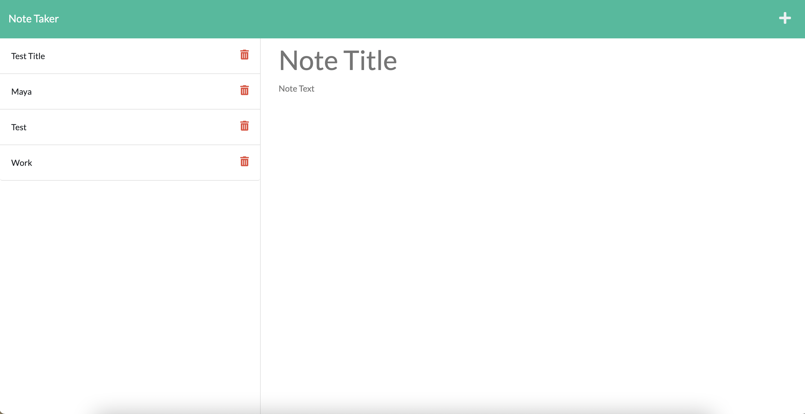
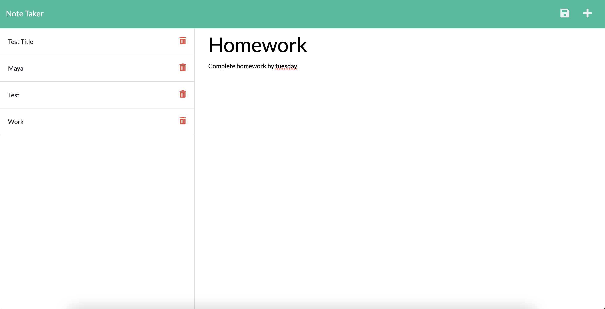

# Note-Taker-App

## Description
This application is used to write down notes that are then stored on a web server. This can be accessed by any device and new notes can be added by any device. Once saved the notes can be viewed on the left side of the page and can be selected to reopen and see the details. 

## Tools Used
- HTML
- CSS
- JavaScript
- Node.js
- Express
- Insomnia
- Heroku

## Links
- Github Repo: https://github.com/mayalorimer/Note-Taker-App
- Deployed Heroku Page: https://fast-taiga-29369.herokuapp.com

## Screenshots 

